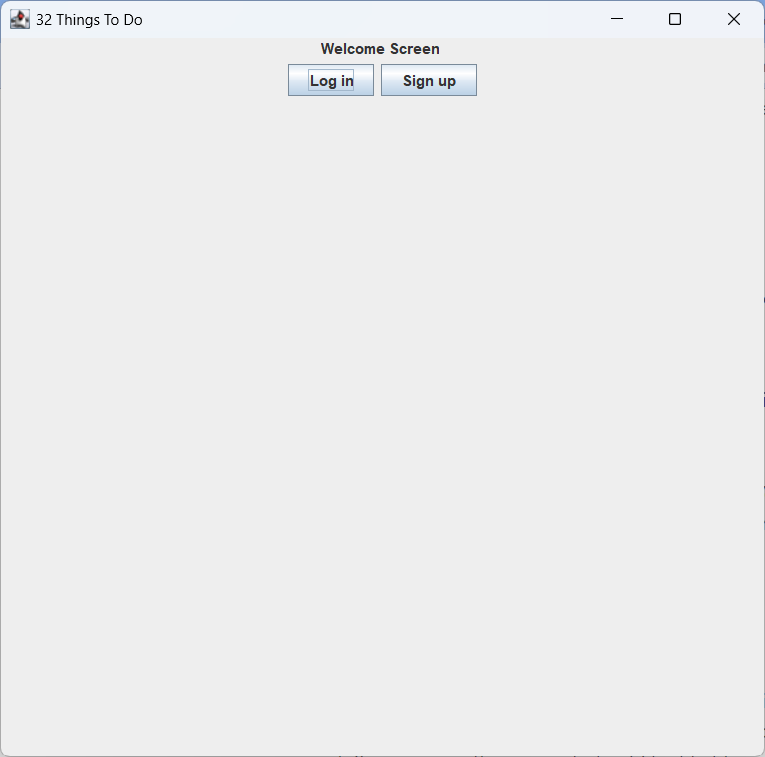
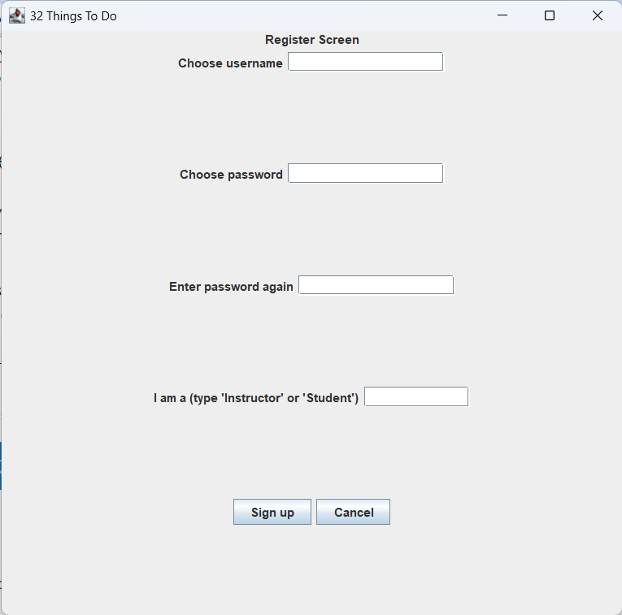
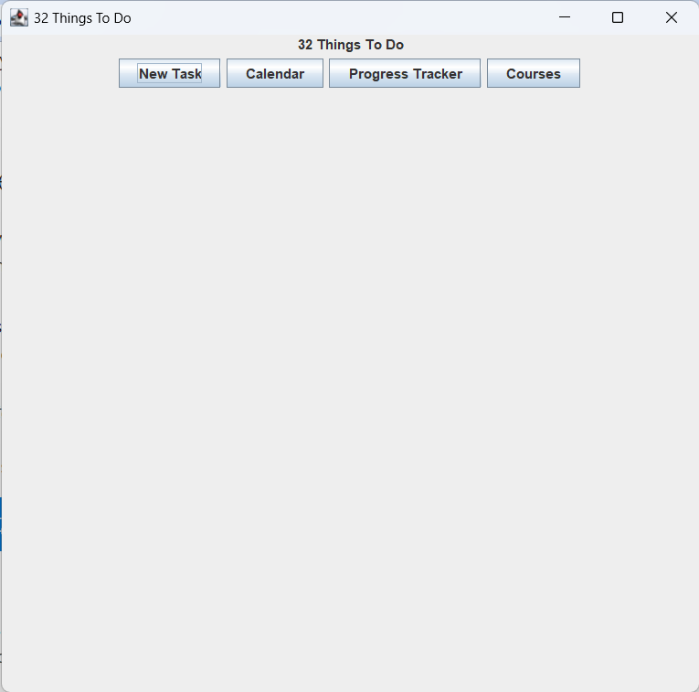
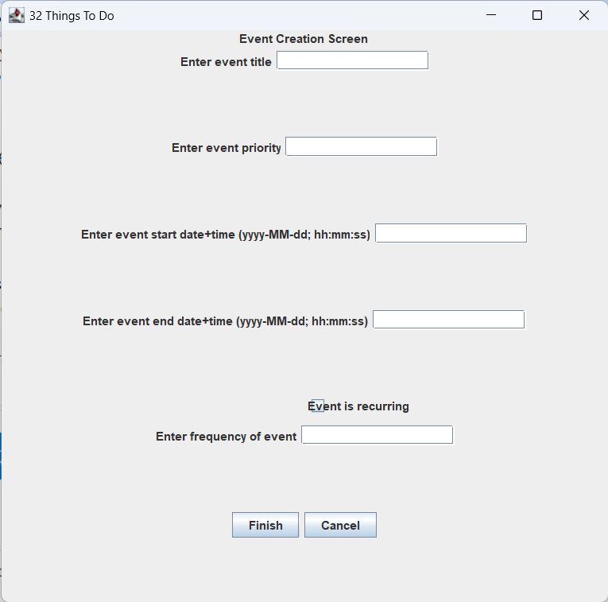
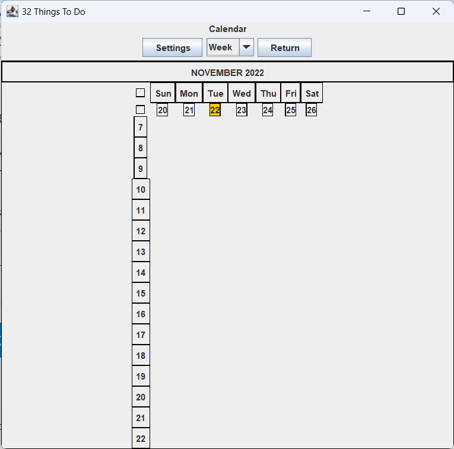
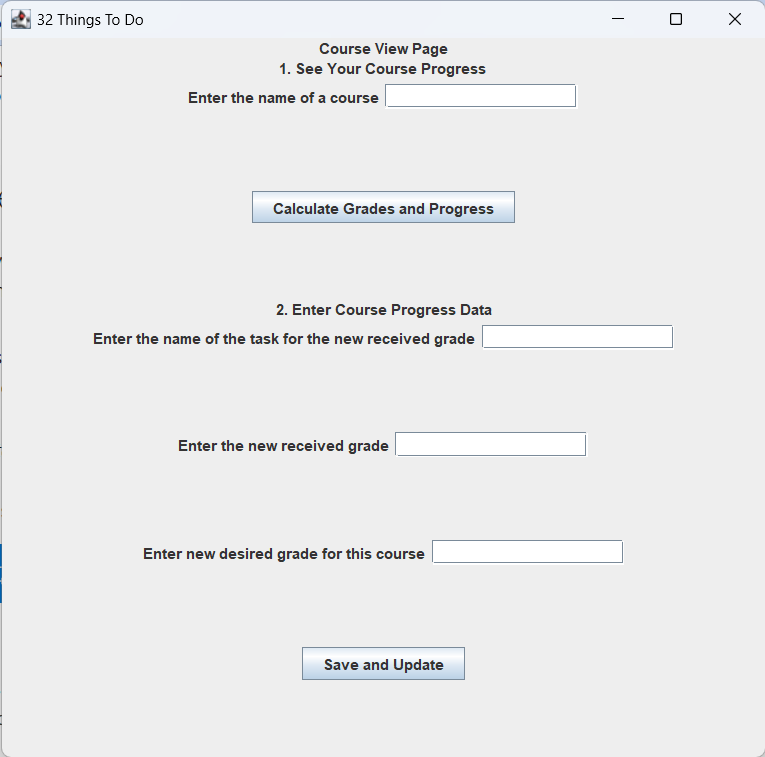
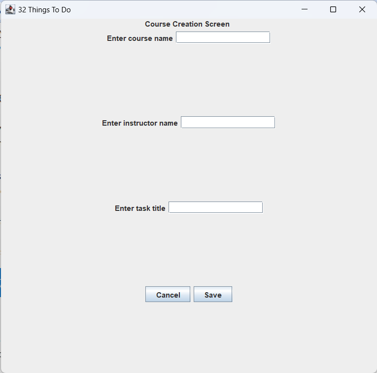

# 32 Things To Do

32 Things To Do is a to-do list application that lets students keep track of their assignments, courses and schedule.

## Register/Log In

Start up the program by running the `Main.java` class in the `src/main/java` directory.
Upon launching the program, a welcome screen with two buttons, `Sign Up` and `Log In`, appears.

If the user is already registered, they should click `Log In`.
They will be redirected to a login screen where they must enter their username and password into the corresponding fields.
If the details they enter match the details saved in the database of users, then they will be taken to the dashboard screen.

If the user has not already registered, they should click `Sign Up`.
They will enter a username and a password (twice), then "Instructor" or "Student" depending on their role.
If the password meets the requirements and the username is not taken, then they will be taken to the dashboard screen.

## Main Dashboard

The user can access all features of the program through the main dashboard.

## To-Do List Task Creation

If the user clicks on the `New Task` button, the screen for creating a new task will be displayed.
On this screen, the user can add, delete and edit the tasks in their to-do list.

To create tasks, the user must fill in the required fields _(for events the format for start and end date is actually yyyy-MM-ddThh:mm:ss, current prompt is incorrect)_ and click `Submit`. 
If the formatting is correct and nothing is left blank (except the `priority` field), it should create a new task of whatever type, generate an ID based on the student's name and course ID (if it is a course task), and save it to the task map and TaskMap file immediately.

To delete a task _(UI not yet implemented)_, the user must click a task to view its info and then click the `Delete` button _(not yet implemented)_. 
This will remove the task from the student's to-do list and move it into their archive, while remaining in the task map.

For editing _(UI not yet implemented)_, the user must click a task to view its info click the `Edit` button.
A screen similar to the create screen should appear, allowing the user to change any info about the task. 
If a section is left blank, no changes will be made.

## Personal Calendar

If the user clicks on the `Calendar` button, the screen for their personal calendar will be displayed.
On this screen, the user's upcoming tasks will be displayed in either a daily, weekly, or monthly view.

Both the daily and the weekly view display any tasks in the user's to-do list that have a timeblock, while the monthly view displays the number of tasks that are due (in the case of Assignments) and that are occurring (in the case of Events and Tests) on each day of the month.
By default, the weekly view is displayed, but the user can change the view through the dropdown menu below the title.

The `Settings` button displays a popup dialog that lets the user change their set working hours for the automatic task scheduling feature.
The `Home` button redirects the user back to the main dashboard.

_Notes:_
- Though the user having the ability to manually select prep time for a Preparatory Task is listed as a feature in the project specifications, I decided against implementing it as while working on the project, we decided to have all tasks' prep time reschedule whenever a change is made to the user's schedule, thus having the user manually select the prep time for all their tasks again was not user-friendly in my opinion.
- I decided against using the Observer design pattern for this feature as by the time using this design pattern was suggested, much of the foundational layer of the program had already been completed, and from my understanding implementing the Observer design pattern would have required an overhaul of our Entities layer, thus I felt that while the design pattern was appropriate for this situation, it was too late to implement it in the program.

## Scheduling Collaborative Tasks

If the user clicks on the `Scheduling CT` button, the screen to schedule a collaborative task will be displayed.
On this screen, the user can schedule a collaborative task.

To schedule a collaborative task, the user must input the name of the task, as well as the time block (start time and end time) in the format YYYY-MM-dd HH:mm.
Then the user must click on the `Submit` button to schedule the collaborative task.
Only the leader/creator of the collaborative task is able to schedule it.
Depending on what the user chose frequency and deadline to be, the dates scheduled will differ.

If there is a conflict with the inputted time block, a screen will pop up that says there is a conflict. 
It is on the user to either communicate with their group about this conflict or to try and reschedule another time. 
If there is no conflict, the dates and times will be scheduled and the program will return the successful input.

## Progress Tracker

If the user clicks on the `Progress Tracker` button, the screen for tracking their academic progress will be displayed.
On this screen, the user can calculate their academic statistics for a course they are enrolled in.

To do so, the user must enter the name of the course and click the button `Calculate Grades and Progress` 
The screen will then display the total weight of completed tasks in that course in % and also a final grade so far of inputted grades for that course. 
If a desired grade has been inputted already or is inputted in this step, the required average for remaining ungraded tasks will be returned (with error messages if the goal grade isn't possible).

Users can also input the grades they receive for a task in the course next, by inputted first the EXACT name of the task and a valid grade in %. 
Users can also adjust their desired grade here. 
After clicking `Save and Update`, the statistics at the top of the page will be updated with the new values.

_Not yet implemented (extending on what is currently working in the MVP feature):_
- error message for non-students (instructors) who try to use feature
- displaying a list of tasks in a course upon student entering a course name
- second part of user story in blueprint which allows users to play around with different scenarios for worst/best case final grades. This part of the program calculates the required average for a given assignment or test

## Course Enrolment/Creation

If the user clicks on the `Courses` button, the screen for course enrolment (`StudentUser` only) and course creation (`InstructorUser` only) will be displayed.
On this screen, the user can either enrol in a course or create a course, depending on their type.

**Course creation:**
Upon clicking the `Create a Course` button, the instructor will be prompted to enter in the following text fields: the course name, the course instructor, and a task _(in future implementation they would be able to add more than one task)_.

If the instructor clicks the `Create` button, the program will check whether the course already exists in the CourseMap and if all required fields are filled out.
If any of checks failed, an error message will pop up.
Once successful, the `Course` will be added to the `CourseMap`, where its key is the course ID, a unique string made up of the concatenation of the course name and course instructor entered by the instructor themselves.
After the program has completed the course creation, the success message will pop up.
During the entire creation process, clicking the `Cancel` button will close the window without any searches performed.

**Course enrolment:**
Upon clicking the `Enrol in a Course` button, the student will be prompted to enter the course name and course instructor of the desired course, as well as their username.
If the student clicks the `Enrol` button, the program will check whether all required text fields are filled out, and if the course ID key can be found in the Map by taking the first 2 inputs and concatenates them (which gives the unique course ID), and searching in the `CourseMap` to see if such a course exists.
If any of the checks failed, an error message would pop up.
Once successful, the username of the students (which is their unique ID) will be added to the `students` parameter (which is an ArrayList of strings) of the `Course` entity associated with the course ID.
Then, the tasks (ArrayList of strings from the `tasks` parameter in the `Course` entity) will be copied and appended to the student’s own task list.
After the program has completed the course enrolment, the success message will pop up.
During the entire enrolment process, clicking the `Cancel` button will close the window without any searches performed.