# 32 Things To Do

32 Things To Do is a to-do list application that lets students keep track of their assignments, courses and schedule.

## Register/Log In

Start up the program by running the `Main.java` class in the `src/main/java` directory.
Upon launching the program, a welcome screen with two buttons, `Sign Up` and `Log In`, appears.

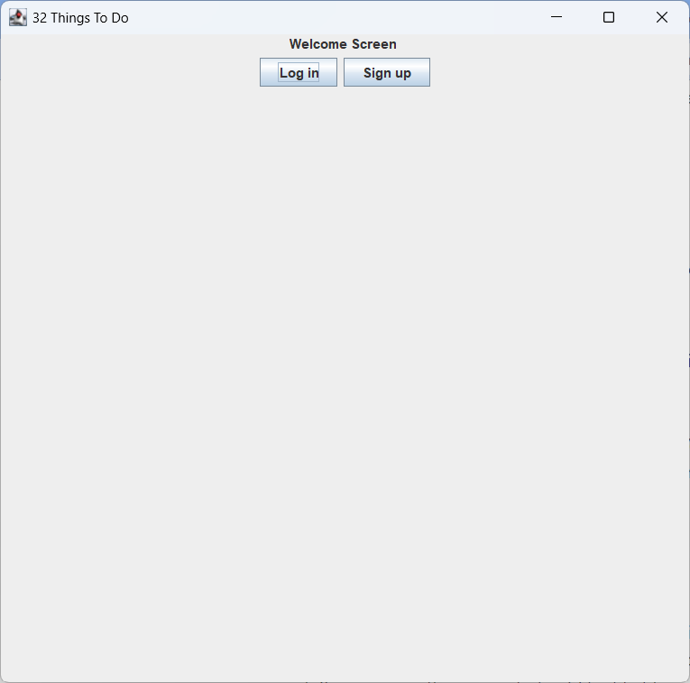

If the user is already registered, they should click `Log In`.
They will be redirected to a login screen where they must enter their username and password into the corresponding fields.
If the details they enter match the details saved in the database of users, then they will be taken to the dashboard screen.

If the user has not already registered, they should click `Sign Up`.
They will enter a username and a password (twice), then "Instructor" or "Student" depending on their role.
If the password meets the requirements and the username is not taken, then they will be taken to the dashboard screen.

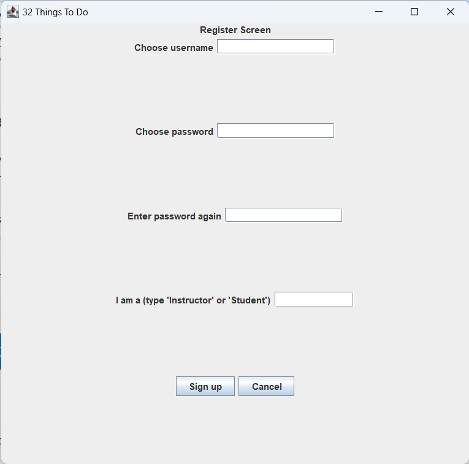

## Main Dashboard

The user can access all features of the program through the main dashboard.

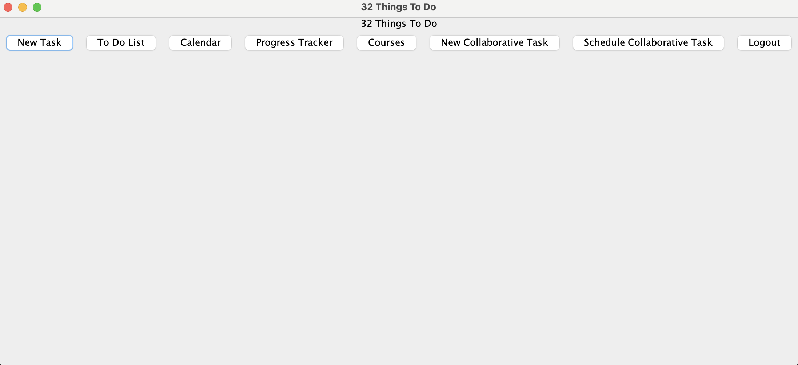

To log out, the user can click the `Logout` button and will be taken back to the Welcome page, where they can log in or sign up a new User.

## To-Do List Task Creation
If the user clicks on the `New Task` button, one of two things will occur:
- If the user is an instructor, they will have a choice between creating a new assignment, new test, or returning to their main screen (`Cancel` button).
  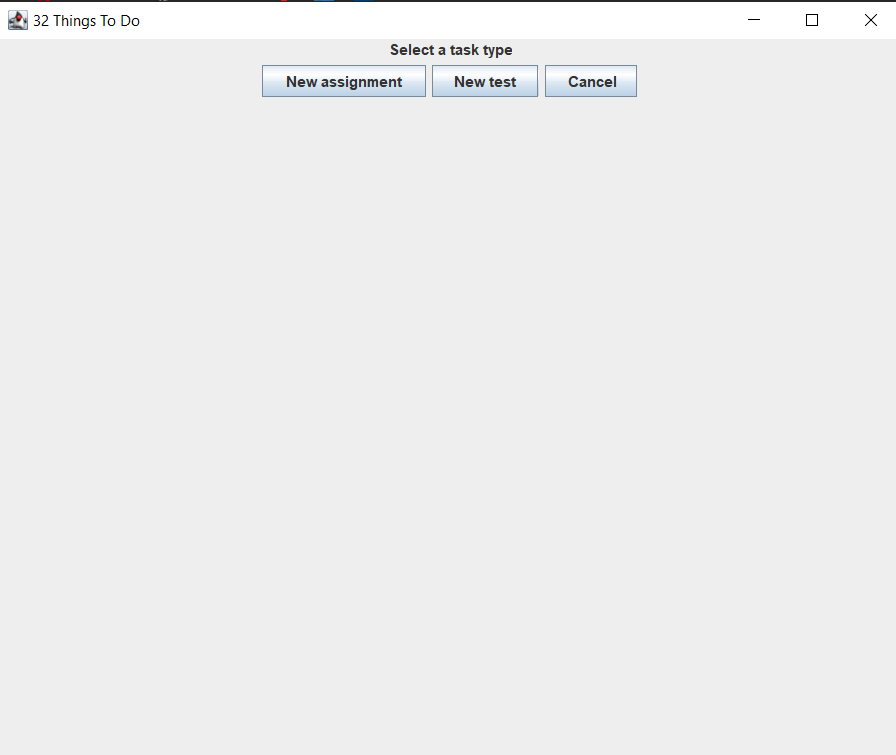
- If the user is a student, they will have a choice between creating a new event, new assignment, new test, or returning to their main screen (`Cancel`).
  (image)
  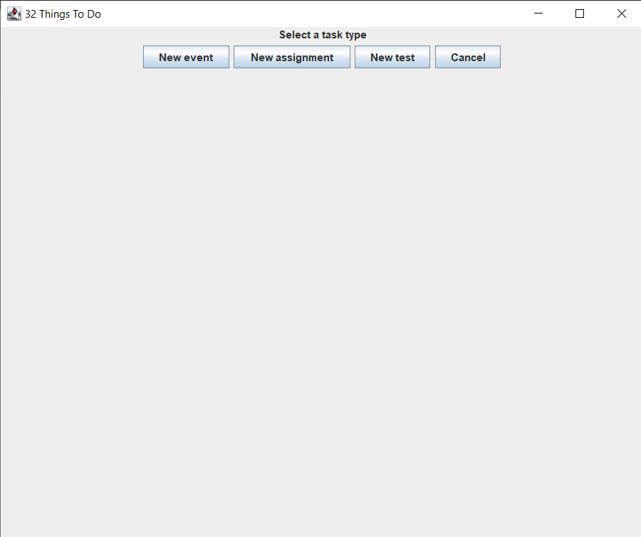
Once they select a task to create, the user will be brought to one of the task creation screens, where they will be prompted to fill in the required information fields.
- For event creation, the user must fill in the title, date, start time, end time, indicate whether the event is recurring, and if so, the frequency of the event (must be one of "monthly", "weekly", "daily").
  - The priority field is optional, and its value will automatically set to 0 if the field is left blank.
  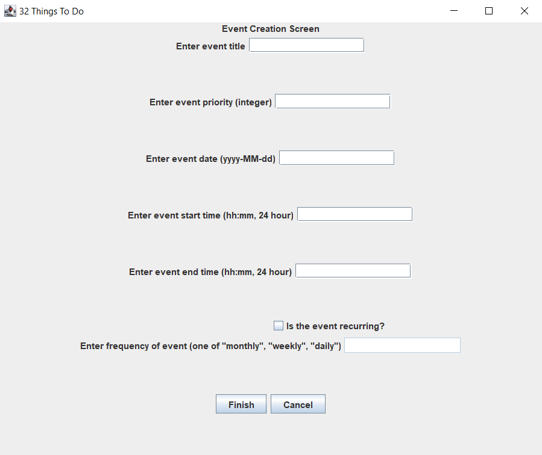
- For assignment creation, the user must fill in a title, due date, and due time.
  - The priority value is once again optional, and instructors are not prompted to input an assignment's priority.
  - The weightage value is optional for both instructors and students, and will be automatically set to 0 if left blank
  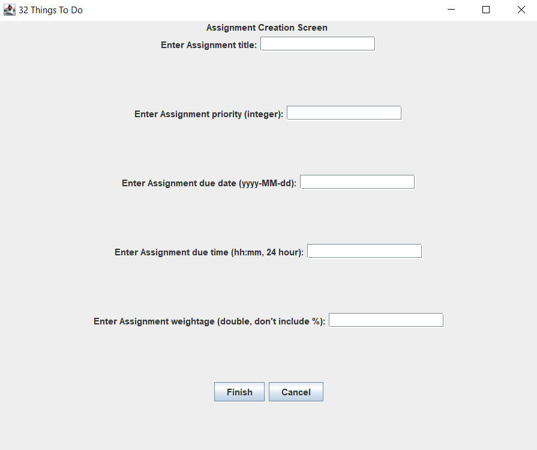
- For test creation, the user must fill in a title, date, start time and end time.
  - Again, priority is optional, and instructors are not prompted to input a test's priority
  - Weightage is once again optional for both instructors and students.
  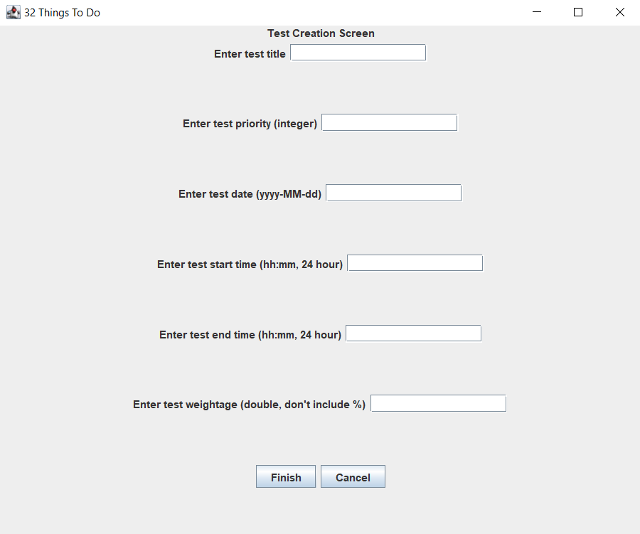

If all required fields are filled in the correct format, a new task should be created of whatever type, with an automatically generated ID based on the task's title, user's name, and course ID (only applicable if it is a course task). The task is then saved to the task map, TaskMap.txt file, and student's to-do list (if applicable) immediately.

## To-Do List Screen
If a student clicks on the `To Do List` button, they will be brought to a screen displaying the titles of all of their tasks, with accompanying `Edit/Delete` buttons.
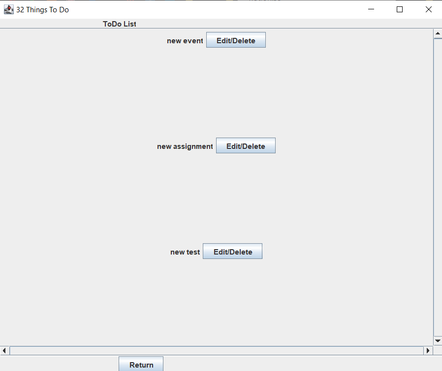
- Clicking any of those buttons will bring the student to the task's respective edit/delete screen.
  - If the task is an event, the edit/delete screen will look almost identical to the creation screen, except with a new checkbox to mark the event as complete, a disabled title field, and pre-filled values in the others.
    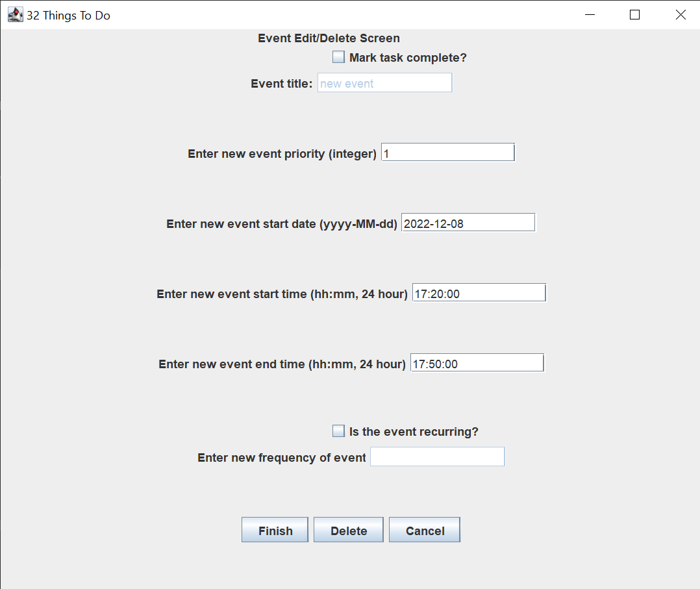
  - If the task is an assignment, the edit/delete screen will look similar to the creation screen, but with the "Mark task complete?" checkbox, disabled title field, prefilled values, and 2 new input fields to indicate time needed to complete the assignment, and time already spent on the assignment.
    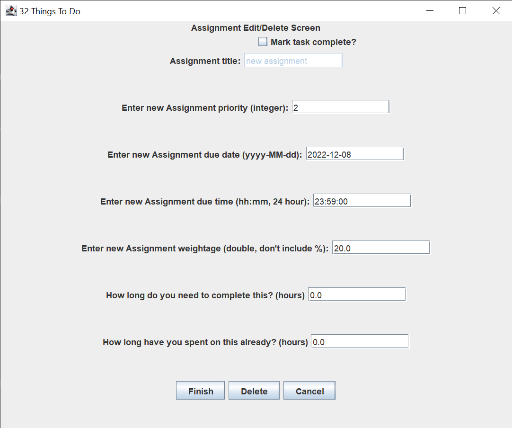
  - If the task is a test, the edit/delete screen will also look similar to the creation screen, but with the same new features as other task edit/delete screens, and the new input fields for time needed and time already spent.
    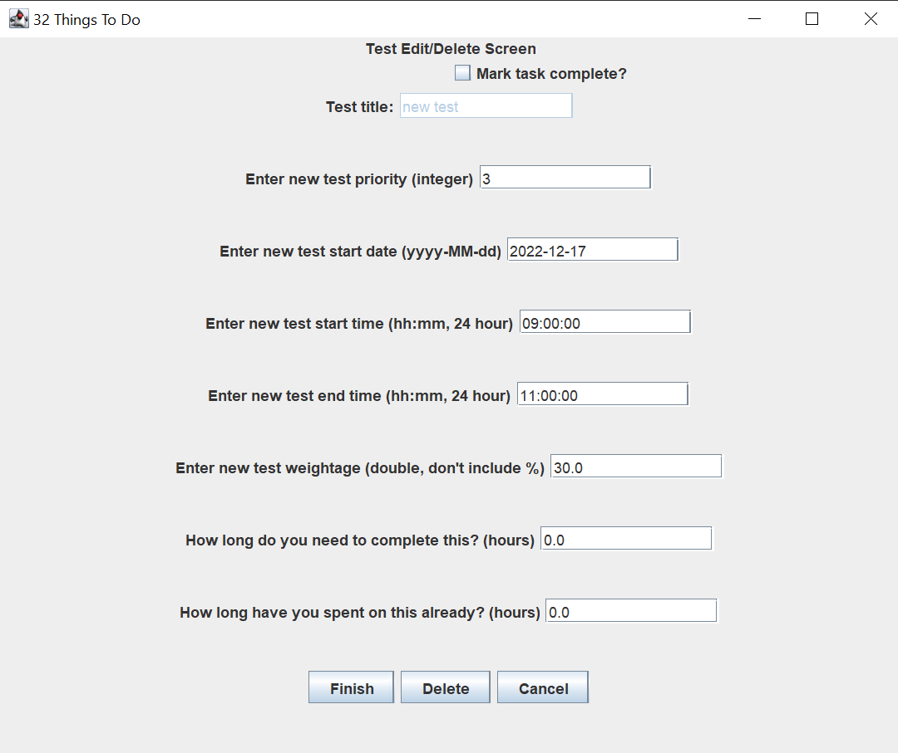
  Once the student fills in the task's new information and presses the `Finish` button, the existing task will be updated to reflect those changes. Any fields left blank result in an unchanged value.
  - If the task is marked as complete, in addition to editing, the task will also be removed from the student's to-do list and into their task archive. 
  If the student presses the `Delete` button, the task will be removed from their to-do list and moved to their archive
  Pressing the `Cancel` button will return the student to their to-do list screen.
- Clicking the `Return` button will return the student to their dashboard

## Personal Calendar

If the user clicks on the `Calendar` button, the screen for their personal calendar will be displayed.
On this screen, the user's upcoming tasks will be displayed in either a daily, weekly, or monthly view.

Both the daily and the weekly view display any tasks in the user's to-do list that have a timeblock, while the monthly view displays the number of tasks that are due (in the case of Assignments) and that are occurring (in the case of Events and Tests) on each day of the month.
By default, the weekly view is displayed, but the user can change the view through the dropdown menu below the title.

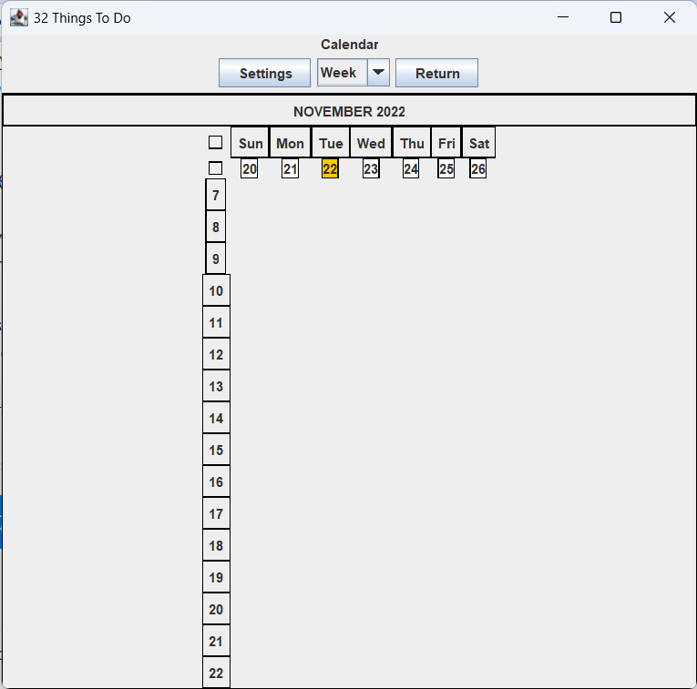

The `Settings` button displays a popup dialog that lets the user change their set working hours for the automatic task scheduling feature.
The `Home` button redirects the user back to the main dashboard.

## Creating and Editing Collaborative Tasks

If the user clicks on the `New Collaborative Task` button (which only appears in the Student Welcome Screen and not in the Instructor Welcome Screen) then,
the user will be brought to the collaborative task creation screen, where they will be prompted to fill in the required information fields.
- The user must fill in the title, start date, start time, end date, end time, deadline date, and deadline time, as well as indicate whether the event is recurring, and if so, the frequency of the collaborative task (must be one of "monthly", "weekly", "daily").
  - The priority field is optional, and its value will automatically set to 0 if the field is left blank.
    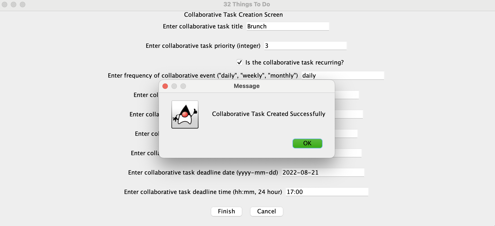

If all required fields are filled in the correct format, a new collaborative task should be created, with an automatically generated ID based on the task's title and user's name. The task is then saved to the task map, TaskMap.txt file, and student's to-do list immediately.

Like with other tasks, if a student clicks on the `To Do List` button, they will be brought to a screen displaying the titles of all of their tasks (including collaborative tasks), with accompanying `Edit/Delete` buttons.
- Clicking any of those buttons will bring the student to the task's respective edit/delete screen.
  - If the task is a collaborative task, the edit/delete screen will look almost identical to the creation screen, except with a new checkbox to mark the event as complete, a disabled title field, pre-filled values in the others, and a new option to change he task's leader and invite other students to join. .
    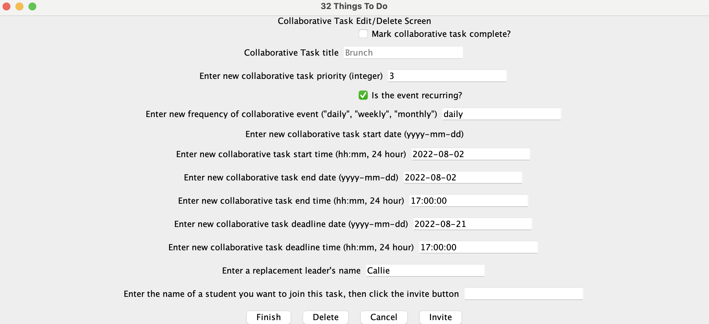
    The student must click the Invite button for the user with the inputted username to be invited. 
    Once the student fills in the task's new information and presses the `Finish` button, the existing task will be updated to reflect those changes. Any fields left blank result in an unchanged value.
  - If the task is marked as complete, in addition to editing, the task will also be removed from the student's to-do list and into their task archive.
    If the student presses the `Delete` button, the task will be removed from their to-do list and moved to their archive
    Pressing the `Cancel` button will return the student to their to-do list screen.
- Clicking the `Return` button will return the student to their dashboard

## Scheduling Collaborative Tasks

If the user clicks on the `Scheduling CT` button, the screen to schedule a collaborative task will be displayed.
On this screen, the user can schedule a collaborative task.

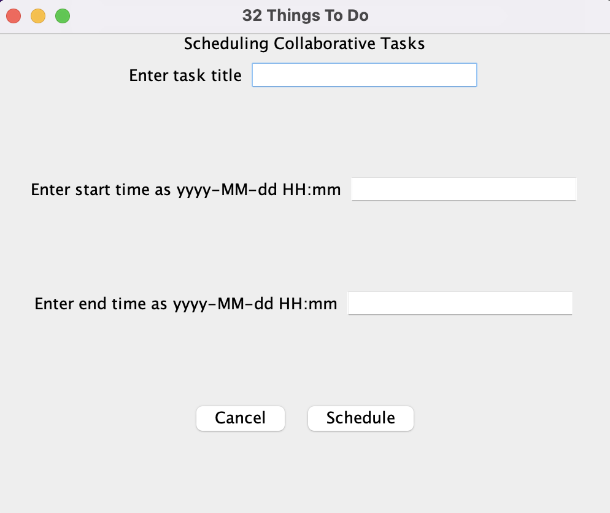

To schedule a collaborative task, the user must input the name of the task, as well as the time block 
(start time and end time) in the format yyyy-MM-dd hh:mm.
Then the user must click on the `Schedule` button to schedule the collaborative task.
Only the leader/creator of the collaborative task is able to schedule it.
Depending on what the user chose frequency and deadline to be, the dates scheduled will differ.

If there is a conflict with the inputted time block, a screen will pop up that says there is a conflict. 
It is on the user to either communicate with their group about this conflict or to try and reschedule another time. 
If there is no conflict, the dates and times will be displayed to the user, and it is on the user to communicate these 
dates to their group.

## Progress Tracker

If the user clicks on the `Progress Tracker` button, the screen for tracking their academic progress will be displayed.
On this screen, the user can calculate their academic statistics for a course they are enrolled in. 
This is a feature for students only.

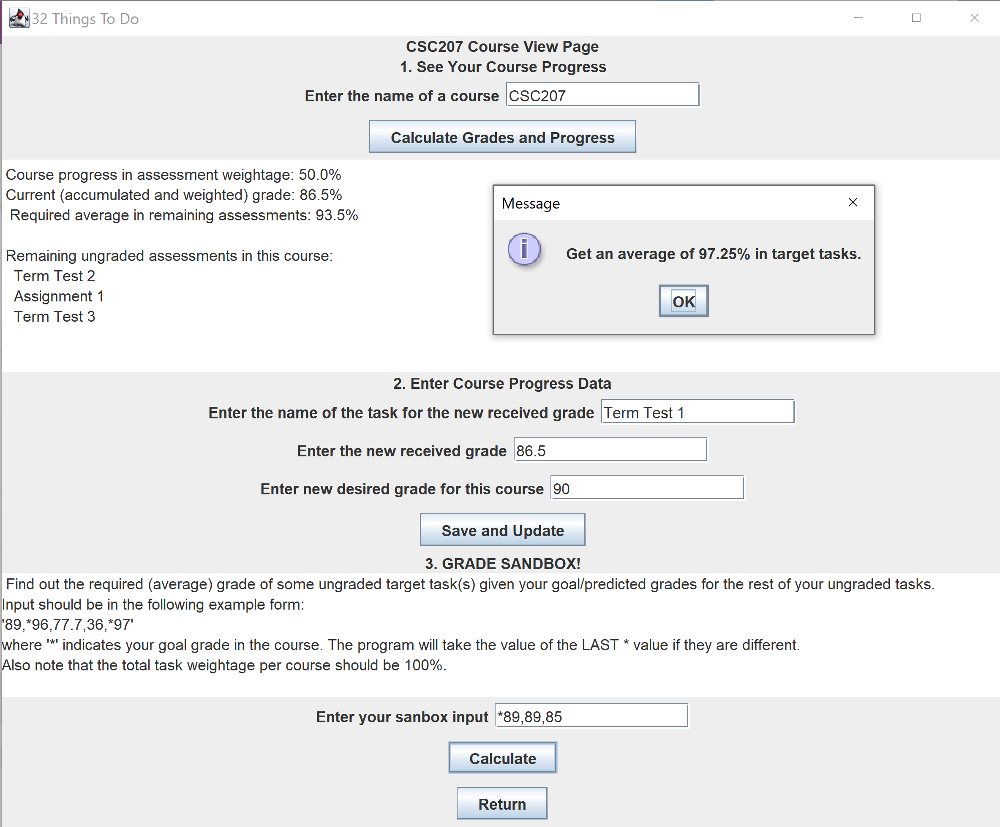

Progress Tracker 
A student enters the name of a course they are enrolled in. User clicks button `Calculate Grades and Progress` and sees their course progress (sum % weightage of completed tasks), mock grade (weighted grade from graded assessments), and their required average in remaining ungraded tasks (if a grade goal has been entered before). 
They are also provided a list of currently ungraded tasks in that course. 

Students can then input (enter or reset) any grades that they receive for a task in the course by inputting first the EXACT name of the task and a valid grade in %. 
They can also adjust their desired grade here. 
After clicking `Save and Update` the statistics at the top of the page are updated with the new values.

Grade Calculator
Another tool of this feature is a grade sandbox where the student can play around with different grade values for their ungraded tasks. Following the order of the list of ungraded tasks above, a student enters a comma-separated list of valid grades in % (numbers only, no spaces) representing hypothetical grades for those tasks. 
For at least one of these tasks, the student specifies the "target task(s)" and the "target grade" by preceding the grade input with a '*' character. The program then outputs the required grade (or average grades) for this task to obtain a final grade of the target grade assuming the other hypothetical grades are achieved. 
If more than one target task is specified and the target grades in the input differ, the output will be calculated using the right-most target grade.

## Course Creation/Enrolment

If the user clicks on the `Courses` button, the screen for course enrolment (`StudentUser` only) and course creation (`InstructorUser` only) will be displayed.
On this screen, the user can either enrol in a course or create a course, depending on their type.

**Course creation:**
Upon clicking the `Create a Course` button, the instructor will be prompted to enter in the following text fields: the course name, the course instructor, and a task _(in future implementation they would be able to add more than one task)_.

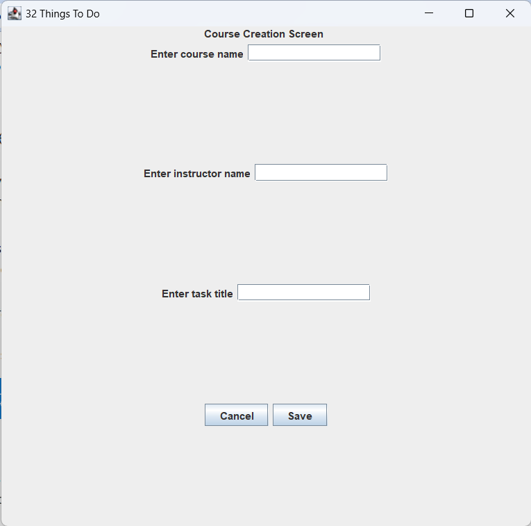

If the instructor clicks the `Create` button, the program will check whether the course already exists in the CourseMap and if all required fields are filled out.
If any of checks failed, an error message will pop up.
Once successful, the `Course` will be added to the `CourseMap`, where its key is the course ID, a unique string made up of the concatenation of the course name and course instructor entered by the instructor themselves.
After the program has completed the course creation, the success message will pop up.
During the entire creation process, clicking the `Cancel` button will close the window without any searches performed.

**Course enrolment:**
Upon clicking the `Enrol in a Course` button, the student will be prompted to enter the course name and course instructor of the desired course, as well as their username.
If the student clicks the `Enrol` button, the program will check whether all required text fields are filled out, and if the course ID key can be found in the Map by taking the first 2 inputs and concatenates them (which gives the unique course ID), and searching in the `CourseMap` to see if such a course exists.
If any of the checks failed, an error message would pop up.
Once successful, the username of the students (which is their unique ID) will be added to the `students` parameter (which is an ArrayList of strings) of the `Course` entity associated with the course ID.
Then, the tasks (ArrayList of strings from the `tasks` parameter in the `Course` entity) will be copied and appended to the student’s own task list.
After the program has completed the course enrolment, the success message will pop up.
During the entire enrolment process, clicking the `Cancel` button will close the window without any searches performed.